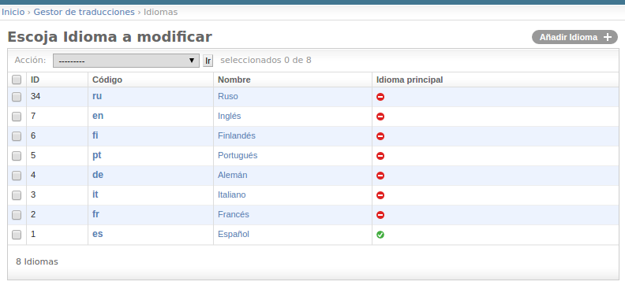
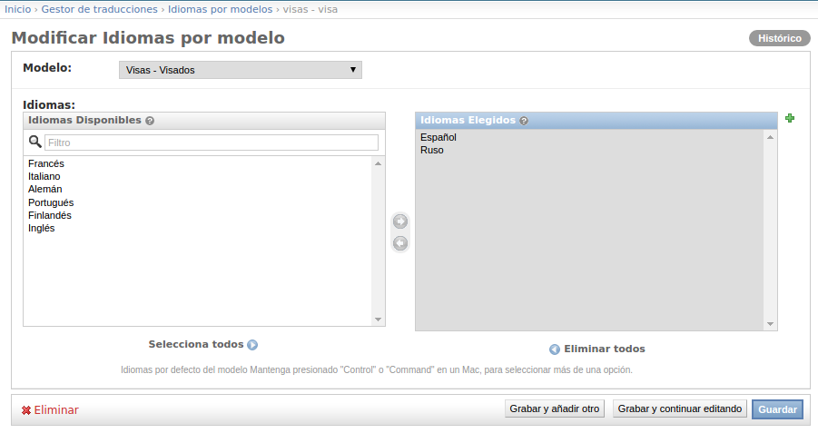
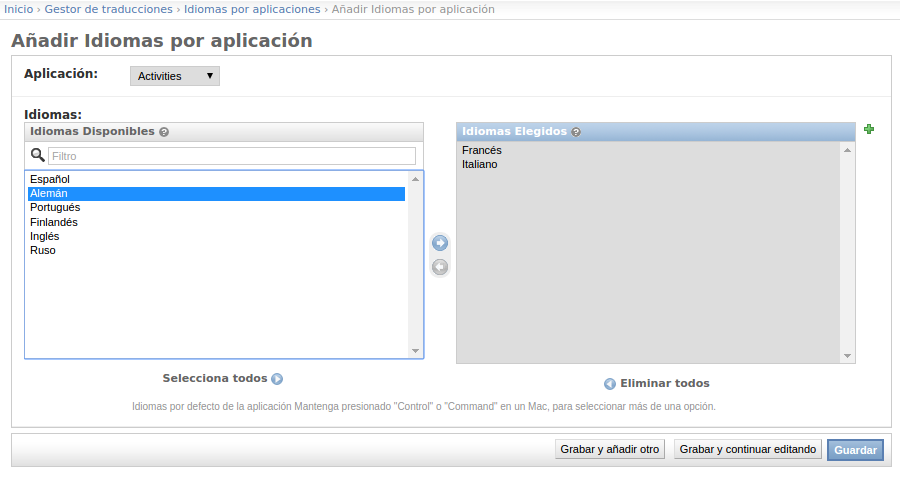
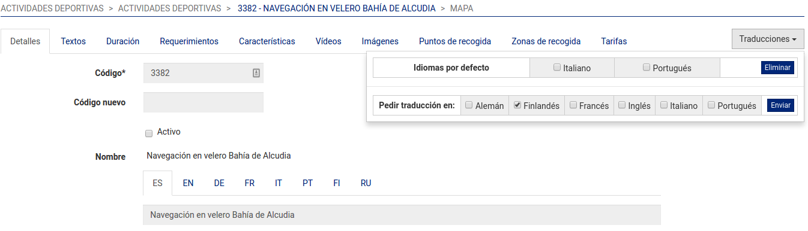
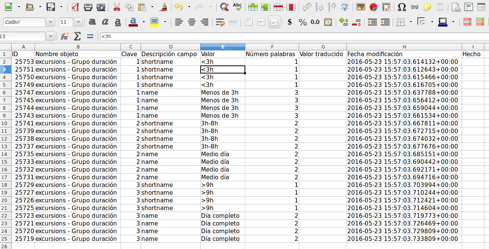

How it works
============
TransManager its based on the handling pre_save django signal. This allow to detect the changes done in
the translatable fields of a model. For each one of the fields that have their original content changed
we generate as many translation tasks as the configured languages per app or model we're editing the fields on.

Initial setup
-------------
The system has to be configured as follows, we have to create the languages we want the translations into
and define the which one of the is the original language of the content.

Then every multilang model has to have set the languages we want the translations into.

We can set the languages per app as well,

in this case if a model has no languages configured we'll take
the model app specified languages.

Besides, every language defined on the TransManager admin has to have
an user assigned. An user can have more than one languages assigned. If there is a language without a user,
the translations tasks will not be created. Every translator is associated with a django user.

.. image:: images/capture_add_user.png

Creation of new record
----------------------
When a new record is created we create a new translation task for every translatable not empty field in
every language configured for the model we're the new record.

Modification of a record
------------------------
When we modify a register, we will create a translation task for every modified translatable field
in the original language.

Translating the tasks
---------------------
Once the tasks are created they have to be translated. When we translate the task, having the main
language original text as reference in the edition form, at the moment of saving the task the main
object will be updated. This way it have the advantage that the translator user does not have to have
access to the main content models, avoiding undesired deletions or modifications on these main models.

Translation a specific records
------------------------------
In Transmanager, every time we insert or modify a content in the main language, a task is generated
for every language defined in the model we are editing.

Nevertheless, we have the possibility to order a translation in one or more languages ONLY
for an specific record of the model, even if the language(s) are not set by default in the model we're editing
.
This can be done throught the "Translations menu" that we can add to our edit template via TransManager template tag

.. code-block:: python

    
    
        
    

From the translation menu, we can order a translation for one o more language for the specific item we're editing.
We can also delete the translation tasks ordered before in one o more languages for the specific item we're editing.
We see as well the default languages for the model (the languages in which the translations tasks will be generated
automatically), these default language that have the grey background.

Finally, you can see the default languages for the specific item as well.

Child models
^^^^^^^^^^^^
When working with specific records, it can happen that we edit a form that includes a formset. The records of
the formset are children of the main form specific record. When we order a translation task for the main specific
record we order as well the translation tasks for the records of the related formset.

In order to achieve the behaviour described above, we have to add the method :code:`get_parent` to the formset model, e.g.:

.. code-block:: python

    class CardCharacteristic(TranslatableModel):

        card = models.ForeignKey(Card, verbose_name=_('Card Experience'), related_name='characteristics')
        type = models.ForeignKey(CardCharacteristicType, verbose_name=_('Tipo'))
        translations = TranslatedFields(
            value=models.TextField(verbose_name=_('Valor'))
        )

        def __str__(self):
            try:
                return '{} - {} - {}'.format(self.card_id, self.type, self.lazy_translation_getter('value'))
            except AttributeError:
                return '[{}]'.format(self.pk)

        class Meta:
            ordering = ('card', 'type')
            verbose_name = _('Característica Card Experience')
            verbose_name_plural = _('Características Card Experience')

        def get_parent(self):
            return self.card

This way when we order a translation task, the generation process will know which the children model is.

.. _enabling_disabling:

Enabling/Disabling a specific record translations
^^^^^^^^^^^^^^^^^^^^^^^^^^^^^^^^^^^^^^^^^^^^^^^^^
When working with specific records, it can happen that we work on the content in several times and we don't want to
generate the translation tasks every time we save the record. In order to accomplish this behaviour, we can add an
attribute to the model we're editing that allows us to know if the record is "enabled" or "disabled". **Enabled** means
the edition of the record is finished and ready to generate the translation tasks. **Disabled** means the record is not
ready yet and we don't want the translation tasks to be generated.

The name of the model attribute can be configured in the settings, via the :ref:`enabled` constant.

The watch of the value of the  attribute above is done by adding the mixin :code:`TranslationMixin` to the model
that have the :code:`enabled` attribute:

.. code-block:: python

    class Card(TranslationTasksMixin, SafeLocationMixin, ModelUniqueIdMixin, TranslatableModel):

        translations = TranslatedFields(
            name=models.CharField(max_length=250, verbose_name=_('Nombre')),
            selling_text=models.TextField(verbose_name=_('Texto vendedor'), blank=True, null=True),
            short_description=models.TextField(verbose_name=_('Descripción corta'), blank=True, null=True),
            large_description=models.TextField(verbose_name=_('Descripción larga'), blank=True, null=True),
            important_info=models.TextField(verbose_name=_('Información importante'), blank=True, null=True),
        )
        code = models.CharField(max_length=50, verbose_name=_('Código'), unique=True, db_index=True)
        enabled = models.BooleanField(_('Activo'), default=True)

        def __str__(self):
            try:
                return '{} - {}'.format(self.code, self.lazy_translation_getter('name'))
            except AttributeError:
                return '[{}]'.format(self.pk)

        class Meta:
            verbose_name = _('Card Experience')
            verbose_name_plural = _('Cards Experience')

The mixin controls the addition/deletion of the translations tasks.

.. code-block:: python

    class TranslationTasksMixin(object):
    """
    Mixin that allows to create/delete the translations tasks when the instance of the model is enabled/disabled
    """

    def save(self, force_insert=False, force_update=False, using=None, update_fields=None):

        create = False
        delete = False

        # get the previous instance
        if self.pk:
            prev = self.__class__.objects.get(pk=self.pk)
        else:
            prev = None

        # decide what to do
        if not self.pk and self.enabled:
            # new instance
            create = True
        elif self.pk and self.enabled and prev and not prev.enabled:
            # from disabled to enabled
            create = True
        elif self.pk and not self.enabled and prev and prev.enabled:
            # from enabled to disabled
            delete = True

        super().save(force_insert, force_update, using, update_fields)

        if create:
            create_translations_for_item_and_its_children.delay(self.__class__, self.pk)
        elif delete:
            delete_translations_for_item_and_its_children.delay(self.__class__, self.pk)

Because there may be lots of translations tasks to generate, the process is called asyncronously,
via the python-rq workers.

Export to Excel
---------------
Translation tasks can be listed and filtered by several criteria, and then the list
can be exported to excel via the export button on the list page.

It can be usefull in order to check the number of words translated for some user in a certain period of time.

