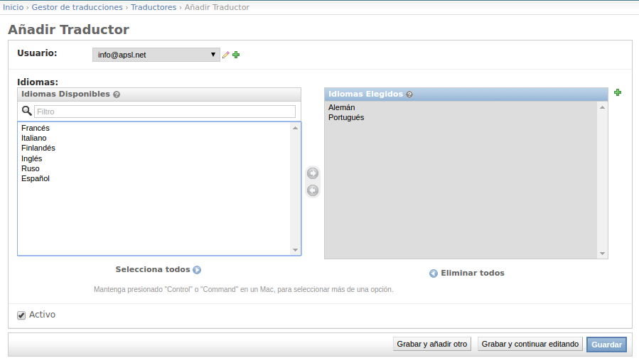

Users
=====
You have to create users that will make the translation work. At least there must be
a user created for each language.

A user can handle more than one language, although
normally there is one user per language.

Each time a translation task is generated it will be assigned to the user
that handles the language specifid in that task.

Notification to user
--------------------
Once every language we've defined in the application has its user, the users will begin
to receive the nofitications of the pending translations tasks, once a day normally.

The notifications are set via cron, e.g:

.. code-block:: python

    # notify_translators
    00 07 * * 1-5 python manage.py notify_translators  >>  $HOME/logs/cron_notify_translators.log 2>&1

From the notification email, the user can access directly to the translation task  by clicking on the detail task link.

Scope of the translator users
-----------------------------
The users, also know as translators, only have access to the translation. None of the translators
have access to the main content models. This way we avoid the risk of the deletion or modification of the
original content and we have not to define translations rols into our main application. TransManager works
in a complete detached way.